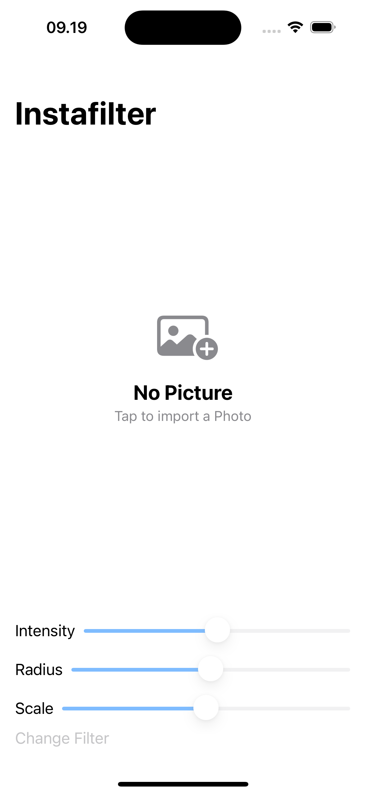
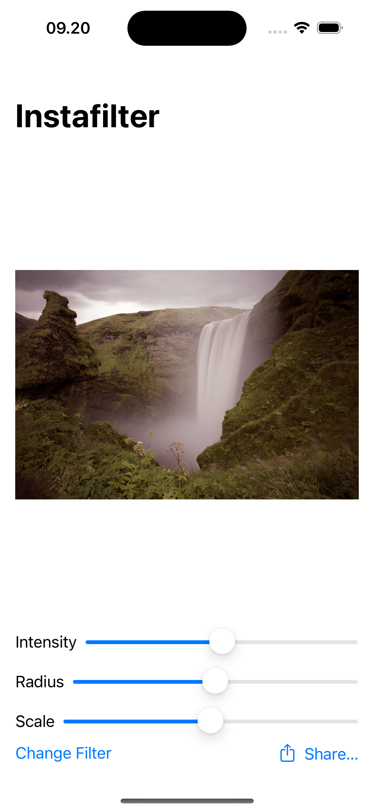
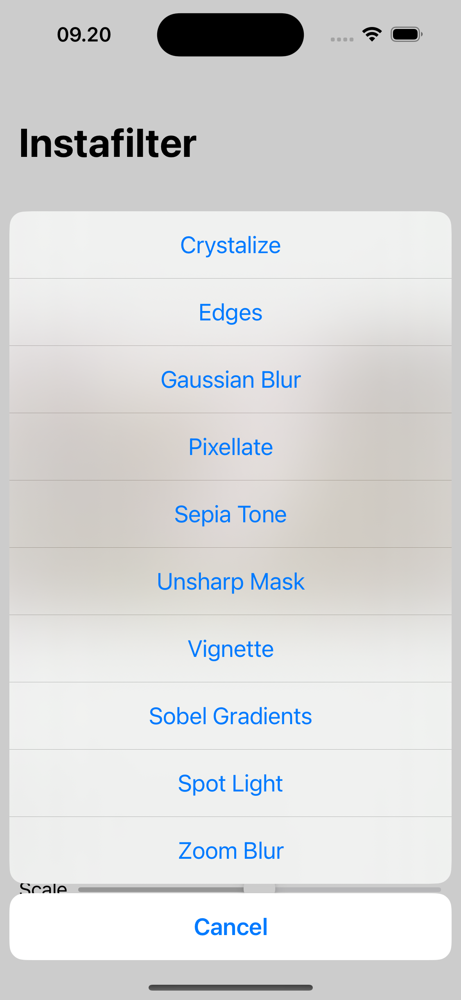
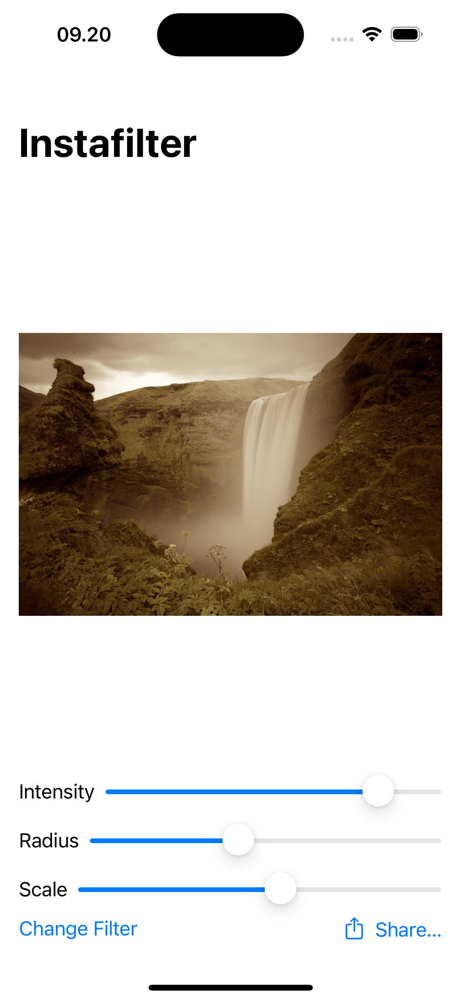
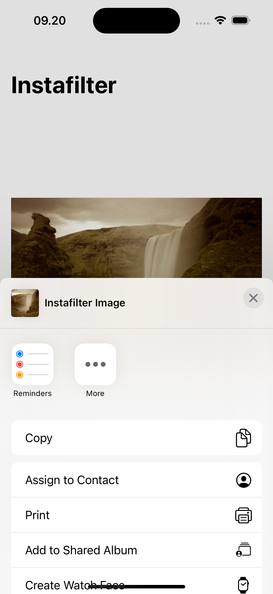

# Instafilter
This is a basic learning project to create an app that allows users to change image filters. The app provides a simple interface where users can input an image, apply filters to modify its appearance, and share the edited image.

---
The source learning is from 12th project of course "100 Days of SwiftUI" (https://www.hackingwithswift.com/100/swiftui)

---
## Goals
1. Display a main page where users can input an image.
2. Provide options to apply various filters to the selected image.
3. Include functionality to preview the filtered image in real-time.
4. Allow users to share the filtered image with others.
5. Create an intuitive and seamless user experience for working with image filters.

# WeSplit – Image Comments Feature

---
